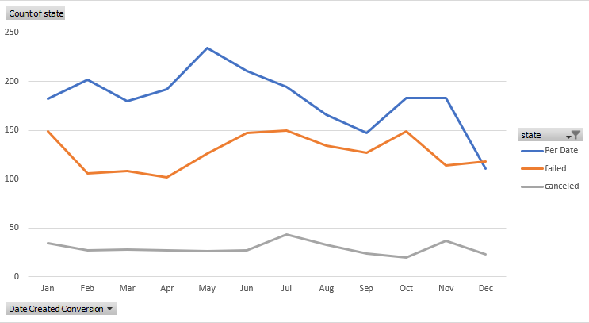
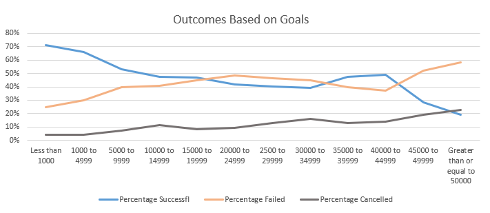
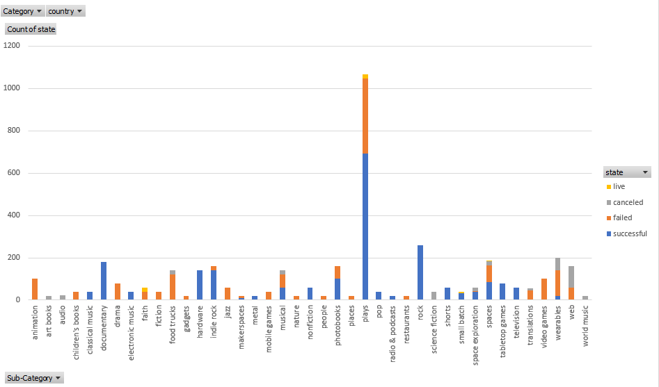
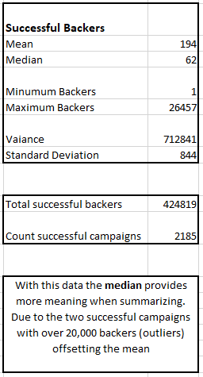
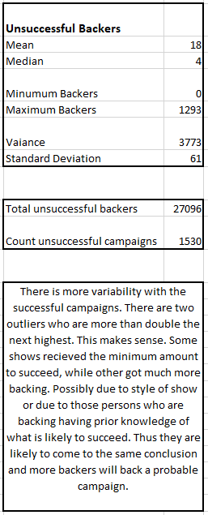

# Excel-kickstart

## Overview of Project:
Over $2 billion has been raised using the massively successful crowdfunding service, Kickstarter, but not every project has found success. Of the more than 300,000 projects launched on Kickstarter, only a third have made it through the funding process with a positive outcome.
Getting funded on Kickstarter requires meeting or exceeding the project's initial goal, so many organizations spend months looking through past projects in an attempt to discover some trick for finding success. 

### Purpose:
Using Excel, organize and analyze a database of 4,000 past projects (including example: project sate (success, fail or cancelled), goals, pledges, country and backers) in order to uncover any hidden trends.

### Analysis of Outcomes Based on Launch Date

This graph shows the highest successrate in May and lowest failure in April.
Successrates are lowest in December. This could be due to holidays or the colder weather.

### Analysis of Outcomes Based on Goals

This graph reveals that the lower thegoal was the more likely it was to succeed (given the proper backing)

### Challenges and Difficulties Encountered

Choosing which way to divide the data presented a challenge at first. There are many sub categories to choose from and which can greaty alter the look if the data if done hap hazzardly. Looking at these resulty it shows that come categories were much more successful, while other were produced at a higher rate ireguardless of successrate.

## Results:

Conclusion:
 *  More backers means more likely to reach goal
 
 
 
 *  Plays are the most frequently endeavored campaign
 *  The goal of less than 1000 has both the highest success rate and the lowest fail rate, thus is the safest to back. Also, the success percentage trend is             generally negative when increasing the goal.  

Some limitations of this dataset:
 *  We do not know if the backers are the same for several campaigns nor how much they individually contributed. Knowing this may show trend in certain backers         having a higher success rate.
 *  The US has the largest total of campaigns in this data at nearly 75 percent, which can skew the data (3038 of 4114). Can always use more data.

Other possible ways to further explore info:
 *  Add the percent success and fail to the chart that shows count of success and fail per category. Example: While theater has the most success, it also has a         large percentage of fail.
 *	We can compare the number of backers (successful and unsuccessful) to each category.
 *	Staff picked campaigns vs success/ fail rate.

